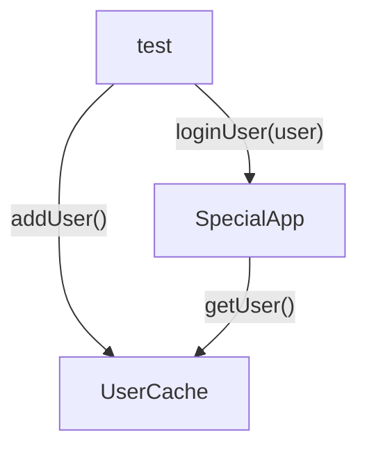

테스트를 작성함으로써 개발 속도를 빠르게 할 수 있지만, 오히려 속도를 늦출 수도 있습니다. 프로덕션 코드를 변경할 때 기존 테스트를 수정할 필요가 없다면 테스트가 개발에 실질적인 도움이 된다고 볼 수 있습니다.
유지 보수성이 테스트를 얼마나 자주 변경해야 하는지를 가늠하는 지표라면, 작은 변경에도 테스트를 고쳐야 하는 상황을 최소로 유지하는 것이 중요합니다. 이를 위해서는 아래 항목을 점검해 볼 필요가 있습니다:

- 언제 테스트가 실패하여 변경이 필요하다는 사실을 깨닫는가?
- 왜 테스트가 실패하는가?
- 어떤 테스트가 실패했을 때 테스트 코드를 반드시 수정해야 하는가?
- 테스트 코드를 반드시 수정할 필요가 없더라도 언제 코드를 변경하는가?

## 테스트 실패로 코드 변경

실제 버그로 발생한 실패를 실제 실패(`true failure`)로, 프로덕션 코드의 버그가 아닌 다른 이유로 발생하는 실패를 거짓 실패(`false failure`)로 지칭합니다.
거짓 실패의 이유 중 하나는 이전 장에서 다룬 것과 같이 테스트 자체에 버그가 있는 경우가 있습니다. 그 외의 다른 이유를 살펴보겠습니다.

### 테스트가 관련이 없거나 다른 테스트와 충돌하는 경우

신규 기능을 추가하면 기존 테스트와 충돌할 수 있습니다. 이때 테스트는 신규 코드의 요구 사항을 제대로 반영했는지 확인하는 용도로도 사용할 수 있습니다. 코드가 변경되어 기대 결과가 달라졌을 수 있으니, 새로운 기능에 맞춰 작성된 테스트는 통과할 수 있지만 기존 테스트는 더 이상 유효하지 않을 수 있습니다.
새로운 기능이 추가되어 실패한 테스트는 더 이상 유효하지 않거나 새로운 요구 사항이 잘못되었을 수 있습니다. 요구 사항이 맞다고 가정하면 유효하지 않은 테스트는 삭제해도 괜찮습니다.
테스트를 삭제하는 것에는 `feature toggle` 을 사용하는 경우가 예외가 될 수 있습니다. 이에 관해서는 추후 더 자세히 살펴볼 예정입니다.

### 프로덕션 코드의 API 변경

테스트 대상 코드가 변경되어 함수나 객체를 사용하는 방식이 달라지면 기능은 동일하더라도 테스트가 실패할 수 있습니다. 이것은 거짓 실패이며, 가능한 한 피해야 합니다.

```ts
import { ILogger } from "./interfaces/logger";

export class PasswordVerifier {
  private _rules: ((input: string) => boolean)[];
  private _logger: ILogger;

  constructor(rules: ((input) => boolean)[], logger: ILogger) {
    this._rules = rules;
    this._logger = logger;
  }

  verify(input: string): boolean {
    const failed = this._rules
      .map((rule) => rule(input))
      .filter((result) => result === false);

    if (failed.length === 0) {
      this._logger.info("PASSED");
      return true;
    }
    this._logger.info("FAIL");
    return false;
  }
}
```

```ts
describe("password verifier 1", () => {
  it("passes with zero rules", () => {
    const verifier = new PasswordVerifier([], { info: jest.fn() }); // 코드의 기존 API 를 사용
    const result = verifier.verify("any input");
    expect(result).toBe(true);
  });

  it("fails with single failing rule", () => {
    const failingRule = (input) => false;
    const verifier = new PasswordVerifier([failingRule], { info: jest.fn() }); // 코드의 기존 API 를 사용
    const result = verifier.verify("any input");
    expect(result).toBe(false);
  });
});
```

#### 코드 수명은 길다

시간이 지나면서 위 코드의 생성자가 더 많은 매개변수를 받거나 타입이 변경되는 등의 변화가 발생할 수 있습니다. 만약 그럴 경우 `PasswordVerifier` 클래스의 인스턴스를 생성하는 모든 테스트를 수정해야 합니다.
위 코드의 생성자가 `ILogger` 대신 `IComplicatedLogger` 타입 로거를 사용하도록 변경되었다고 가정해보겠습니다.

```ts
import { IComplicatedLogger } from "./interfaces/complicated-logger";

export class PasswordVerifier2 {
  private _rules: ((input: string) => boolean)[];
  private _logger: IComplicatedLogger;

  constructor(rules: ((input) => boolean)[], logger: IComplicatedLogger) {
    this._rules = rules;
    this._logger = logger;
  }

  verify(input: string): boolean {
    const failed = this._rules
      .map((rule) => rule(input))
      .filter((result) => result === false);

    if (failed.length === 0) {
      this._logger.info("PASSED");
      return true;
    }
    this._logger.info("FAIL");
    return false;
  }
}
```

#### 팩토리 함수로 객체를 만드는 과정을 분리해야 한다

유지 보수성을 떨어뜨릴 수 있는 잠재적인 문제 상황을 피하는 방법은 테스트할 코드의 생성 과정을 분리하거나 추상화하는 것입니다. 팩토리 함수 또는 팩토리 메서드를 사용하여 생성자의 변경 사항을 중앙에서만 처리할 수 있도록 하는 것입니다. 이 방식이 더 발전한 패턴은 `Object Mother` 패턴입니다.

> Object Mother 패턴에 대해 더 알아보기 위해서는 마틴 파울러의 글을 참고하세요.  
> https://martinfowler.com/bliki/ObjectMother.html

```ts
describe("password verifier 1", () => {
  const makeFakeLogger = () => {
    return { info: jest.fn() };
  };

  const makePasswordVerifier = (
    rules: ((input) => boolean)[],
    fakeLogger: ILogger = makeFakeLogger()
  ) => {
    return new PasswordVerifier(rules, fakeLogger);
  };

  it("passes with zero rules", () => {
    const verifier = makePasswordVerifier([]);
    const result = verifier.verify("any input");
    expect(result).toBe(true);
  });
});
```

아래 코드는 생성자의 시그니처 변경에 따라 테스트 코드를 리팩토링 한 예제입니다. 실제 테스트 코드는 수정하지 않고 팩토리 함수만 변경하여 모든 객체 생성부를 업데이트할 수 있었습니다.

```ts
describe("password verifier (ctor change)", () => {
  const makeFakeLogger = () => {
    return Substitute.for<IComplicatedLogger>();
  };

  const makePasswordVerifier = (
    rules: ((input) => boolean)[],
    fakeLogger: IComplicatedLogger = makeFakeLogger()
  ) => {
    return new PasswordVerifier2(rules, fakeLogger);
  };

  it("passes with zero rules", () => {
    const verifier = makePasswordVerifier([]);

    const result = verifier.verify("any input");

    expect(result).toBe(true);
  });

  it("fails with single failing rule", () => {
    const failingRule = (input) => false;
    const verifier = makePasswordVerifier([failingRule]);

    const result = verifier.verify("any input");

    expect(result).toBe(false);
  });
});
```

### 다른 테스트가 변경되었을 경우

테스트가 독립적이지 않고 서로 영향을 주면 큰 문제가 발생합니다. 같은 기능을 검증하더라도 각 테스트는 서로 격리된 공간에서 실행되어야 합니다.

> 계속해서 실패하는 테스트
> 필자의 일화 소개입니다. 프로젝트에서 관리하던 특정 단위 테스트가 갑자기 통과하다, 실패하는 등의 이상 동작을 보였습니다. 조사해보니 해당 테스트가 코드의 한 부분에서 불안정한 다른 테스트를 호출하고 있었던 것을 알아냈습니다.  
> 이를 조사하며 테스트 자체의 버그와 여러 문제로 그동안 신경쓰지 않았던 버그가 프로덕션 코드에도 많이 숨어 있다는 것을 알아냈습니다. 이처럼 반복적으로 실패하는 테스트가 결국에는 중요한 문제를 드러내는 경우가 종종 있습니다.

테스트가 제대로 분리되지 않으면 각 테스트가 서로 간섭하게 됩니다. 개발자들이 테스트 문제를 찾으려고 하지 않기 때문에 문제가 생기면 원인을 찾는 데에 많은 시간이 걸릴 수 있습니다. 가장 먼저 확인해볼 수 있는 것은 '순서가 정해진 테스트' 입니다.

#### 순서가 정해진 테스트

'순서가 정해진 테스트'는 어떤 테스트가 이전 테스트의 실행 여부에 따라 결과가 달라지는 상황입니다. 이는 테스트가 다른 테스트 때문에 설정 값이 바뀌거나 공유 변수 같은 자원의 상태 값이 변경되는 것에 영향을 받기 떄문입니다. 예를 들어, 하나의 테스트가 메모리 내 공유 변수나 데이터베이스 같은 외부 자원을 변경하고 다른 테스트가 그 변수 값을 참조하는 형태로 동작한다면, 두 테스트는 실행 순서에 영향을 받는다고 볼 수 있습니다.
기억해야 할 것은 테스트 러너는 동일한 순서로 테스트를 실행하는 것을 보장하지 않습니다.
예를 들어, 아래와 같이 싱글톤 객체 `UserCache` 를 다루는 상황을 살펴보겠습니다.



```ts
// sharedUserCache.ts
export interface IUserDetails {
  key: string;
  password: string;
}

export interface IUserCache {
  addUser(user: IUserDetails): void;
  getUser(key: string);
  reset(): void;
}

export class UserCache implements IUserCache {
  users: object = {};

  addUser(user: IUserDetails): void {
    if (this.users[user.key] !== undefined) {
      throw new Error("user already exists");
    }
    this.users[user.key] = user;
  }

  getUser(key: string) {
    return this.users[key];
  }

  reset(): void {
    this.users = {};
  }
}

let _cache: IUserCache;
export function getUserCache() {
  if (_cache === undefined) {
    _cache = new UserCache();
  }
  return _cache;
}
```

```ts
// specialApp.ts
import { getUserCache, IUserCache, IUserDetails } from "./sharedUserCache";

export class SpecialApp {
  loginUser(key: string, pass: string): boolean {
    const cache: IUserCache = getUserCache();
    const foundUser: IUserDetails = cache.getUser(key);
    if (foundUser?.password === pass) {
      return true;
    }
    return false;
  }
}
```

```ts
// specialApp.spec.ts
import { getUserCache } from "./sharedUserCache";
import { SpecialApp } from "./specialApp";

describe("Test Dependence", () => {
  describe("loginUser with loggedInUser", () => {
    test("no user, login fails", () => {
      const app = new SpecialApp();
      const result = app.loginUser("a", "abc"); // <------- 캐시가 비어 있어야 함
      expect(result).toBe(false);
    });
  });

  test("can only cache each user once", () => {
    getUserCache().addUser({
      key: "a",
      password: "abc",
    });

    expect(() =>
      getUserCache().addUser({
        key: "a",
        password: "abc",
      })
    ).toThrowError("already exists");
  });

  test("user exists, login succeeds", () => {
    const app = new SpecialApp();
    const result = app.loginUser("a", "abc"); // <--------- 캐시에 유저 정보가 있어야 함
    expect(result).toBe(true);
  });
});
```

위 테스트 케이스에서는 첫번째, 세번째 테스트가 모두 두번쨰 테스트에 의존하고 있습니다. 제스트의 `test.only()` 키워드를 사용하여 세번쨰 테스트만 실행하면 이 테스트는 실패합니다.
이러한 안티 패턴은 보통 테스트 일부를 헬퍼 함수로 빼지 않고 사용하려고 할 때 발생합니다. 이를 해결하려면 아래 단계를 따라 리팩토링을 해야 합니다:

- 유저를 추가하는 헬퍼 함수 구현.
- 여러 테스트에서 이 헬퍼 함수를 사용.
- 테스트 사이에 유저 캐시를 초기화.

```ts
import { getUserCache } from "./sharedUserCache";
import { SpecialApp } from "./specialApp";

const addDefaultUser = () =>
  // <----------- 유저 생성을 별도 헬퍼 함수로 분리
  getUserCache().addUser({
    key: "a",
    password: "abc",
  });

const makeSpecialApp = () => new SpecialApp();

describe("Test Dependence v2", () => {
  beforeEach(() => getUserCache().reset()); // <--------- 테스트 간 유저 캐시 리셋

  describe("user cache", () => {
    test("can only add cache use once", () => {
      addDefaultUser();

      expect(() => addDefaultUser()).toThrowError("already exists");
    });
  });

  describe("loginUser with loggedInUser", () => {
    test("user exists, login succeeds", () => {
      addDefaultUser();
      const app = makeSpecialApp();

      const result = app.loginUser("a", "abc");
      expect(result).toBe(true);
    });

    test("user missing, login fails", () => {
      const app = makeSpecialApp();

      const result = app.loginUser("a", "abc");
      expect(result).toBe(false);
    });
  });
});
```

위 예제에서 `makeSpecialApp()` 과 `addDefaultUser()` 함수를 재사용 가능하도록 헬퍼 함수로 분리해냈습니다. 각 테스트가 실행되기 전에 유저 캐시를 초기화하는 작업을 `beforeEach()` 함수에서 실행합니다. 이를 통해 각각의 테스트가 별도로 동작함을 보장할 수 있습니다.

## 유지 보수성을 높이는 리팩토링 방법

지금까지는 테스트 실패 때문에 어쩔 수 없이 테스트를 변경해야하는 경우를 살펴보았습니다. 이제는 테스트가 실패하지 않더라도 시간이 지나도 처음의 견고함을 유지하고 유지 보수성을 오래 보장할 수 있는 리팩토링 방법을 알아보겠습니다.

### private 또는 protected 메소드 사용하지 않기

두 키워드는 특정한 이유로 메소드에 대한 접근을 제한하는 용도로 사용됩니다. 구현 세부 사항을 숨겨 나중에 구현이 변경되더라도 외부에서 보이는 동작은 바뀌지 않도록 하기 위함입니다.
private 메소드를 테스트하는 것은 시스템 내부의 약속이나 규칙을 테스트하는 것과 같습니다. 우리는 시스템 내부가 아닌 외부의 모습만 신경 쓰면 됩니다.
또한 private 메소드는 홀로 존재하지 않고, 어떠한 public 메소드가 이를 호출해줘야만 실행됩니다. 즉, private 메소드는 항상 외부 인터페이스로 시작하는 더 큰 작업의 일부를 담당합니다. 그 작업은 반환 값, 상태 변경, 서드 파티 호출 중 하나로 끝납니다. 내부 구현이 아무리 완벽하게 작동하더라도, 외부 인터페이스에서 이를 잘못 사용하고 있으면 시스템 전체가 제대로 작동하지 않을 수 있습니다. 결국 중요한 점은 시스템의 외부 동작(public 메소드가 올바르게 작동하는지)을 확인하는 것입니다. public 메소드로 private 메소드를 간접적으로 테스트하는 것이 더 효과적입니다.
private 메소드를 테스트해야겠다면, 이 메소드를 public 또는 static 메소드로 바꾸고 이 메소드를 사용하는 코드를 public 메소드로 만들어 테스트하면 더 깔끔해집니다. 경우에 따라 이 메소드를 다른 클래스로 옮기는 것도 방법이 될 수 있습니다.

#### 메소드를 public 으로 만들기

메소드를 public 으로 만드는 것이 항상 나쁜 것만은 아닙니다.
어떤 메소드를 테스트하고 싶다는 것은 그 메소드가 일정하게 동작하거나 역할이 중요하다는 의미일 수 있습니다. 메소드를 public 으로 만들면 이를 명확하게 드러내는 것입니다. 반면 메소드를 private 로 두면 나중에 그 코드를 유지 보수할 때 private 메소드를 사용하는 코드는 걱정할 필요 없이 private 메소드의 구현부를 마음대로 변경할 수 있습니다.

#### 메소드를 새로운 클래스나 모듈로 분리하기

메소드에 독립적으로 동작할 수 있는 로직이 많이 포함되어 있거나, 해당 메소드와 연관된 상태값을 사용한다면 새로운 클래스나 모듈로 분리하는 것이 좋습니다. 이렇게 하면 해당 클래스만 따로 테스트할 수 있습니다. `레거시 코드 활용 전략, 마이클 페더스`, `클린 코드, 로버트 C. 마틴` 과 같은 책에서 또한 이 내용을 다룹니다.

#### stateless 한 private 메소드를 public, static 메소드로 만들기

메소드가 stateless 하다면 static 으로 변경하는 것이 좋습니다(언어가 이를 지원하는 경우). 이렇게 하면 테스트하기 훨씬 쉽고 메소드 이름으로 유틸리티 메소드라는 점을 더 명확하게 드러낼 수 있습니다.

### 테스트에서도 DRY 원칙 고수

단위 테스트에서 역시 중복은 좋지 않은 영향을 줄 수 있습니다. 코드에 중복이 있다면 어떤 변경이 발생했을 때 모든 중복된 부분을 함께 수정해야 하기 때문입니다.
앞선 예제에서 살펴보았듯 헬퍼 함수를 사용하면 테스트 중복을 줄일 수 있습니다. 물론 중복을 제거하는 것이 지나치면 가독성을 해칠 수도 있습니다.

### 초기화 함수를 사용하지 않기

이 책의 필자는 각 테스트 전에 실행되는 `beforeEach()` 함수(초기화 함수)를 좋아하지 않습니다. 이 함수는 중복을 제거하려는 목적으로 사용되지만, 책의 필자는 헬퍼 함수를 사용하는 것을 훨씬 선호합니다. 초기화 함수를 잘못 사용하는 예시는 아래와 같습니다:

- 파일 내 일부 테스트에서만 사용하는 객체를 초기화 함수에서 초기화한다.
- 길고 이해하기 어려운 초기화 코드를 작성한다.
- 초기화 함수 내에서 목이나 가짜 객체를 만든다.

또한 초기화 함수를 사용하는 것에는 한계가 있는데, 간단한 헬퍼 함수를 사용하는 것으로 이를 해소할 수 있습니다:

- 초기화 함수는 객체를 초기화할 때만 유용하다.
- 초기화 함수 사용은 중복 제거의 최선책은 아니다. 중복 코드 제거는 검증 단계의 로직을 간단하게 하거나 코드를 특정 방식으로 호출하는 것도 포함된다.
- 초기화 함수는 매개변수나 반환 값을 가질 수 없다.
- 초기화 함수는 테스트 실행 전에 실행되어 특정 테스트의 필요에 맞게 세밀하게 조정할 수 없다. 모든 테스트에 동일한 초기화 작업을 적용해야 하므로 특정 상황에 맞춘 설정을 지원하지 못한다.
- 초기화 함수에는 현재 테스트 클래스의 모든 테스트에 적용되는 코드만 포함해야 한다. 그렇지 않으면 코드가 읽기 어렵고 이해하기 어렵다.

테스트 코드도 프로덕션 코드처럼 깔끔해야 합니다. 팩토리 메소드와 헬퍼 함수를 적극 사용하여 추후 개발자들이 코드를 유지 보수할 때 더 쉽고 편안한 환경에서 작업할 수 있도록 해야 합니다.

### 매개변수화된 테스트(Parameterized test)로 중복 코드 제거

여러 언어의 다양한 테스트 프레임워크에서 매개변수화된 테스트를 지원합니다. 제스트에서는 `test.each()`, `it.each()` 함수를 사용할 수 있습니다.
매개변수화 패턴은 원래 `beforeEach()` 블록에 있어야 할 설정 로직을 각 테스트의 준비(arrange) 단계로 옮길 수 있습니다. 또한 아래 예제와 같이 검증 로직의 중복을 줄일 수 있습니다.

```ts
const sum = (numbers) => {
  if (numbers.length > 0) {
    return parseInt(numbers);
  }
  return 0;
};

describe("sum with regular tests", () => {
  test("sum number 1", () => {
    const result = sum("1");
    expect(result).toBe(1);
  });
  test("sum number 2", () => {
    const result = sum("2");
    expect(result).toBe(2);
  });
});

describe("sum with parameterized tests", () => {
  test.each([
    ["1", 1],
    ["2", 2],
  ])("add %s, returns that number", (input, expected) => {
    const result = sum(input);
    expect(result).toBe(expected);
  });
});
```

매개변수화 방식은 테스트 코드 간 중복을 줄이는 데 도움이 되지만, 동일한 테스트 시나리오에서는 입력 값과 결과 값이 다를 때만 이 방식을 사용하도록 주의하세요.

## 과잉 명세된 테스트

과잉 명세(`overspecification`)된 테스트는 단순히 코드의 외부 동작을 검증하는 것이 아니라 코드 내부가 어떻게 구현되어야 하는지까지 검증하는 테스트를 의미합니다. 단순히 종료점이 올바른지 확인하는 것을 넘어 구현 세부사항까지 확인하는 경우입니다. 테스트가 지나치게 구체적이고 복잡해지면 코드를 변경 할 때 테스트를 자주 수정해야되는 문제가 생길 수 있습니다. 아래와 같은 경우 단위 테스트가 과잉 명세되었다고 볼 수 있습니다:

- 테스트가 객체의 내부 상태만 검증한다.
- 테스트가 목을 여러 개 만들어 사용한다.
- 테스트가 스텁을 목처럼 사용한다.
- 테스트가 필요하지 않은데도 특정 실행 순서나 정확한 문자열 비교를 포함한다.

### 목을 사용한 내부 동작 과잉 명세

작업 단위의 종료점을 확인하는 대신 클래스나 모듈의 내부 함수가 호출되었는지만 검증하는 안티 패턴입니다. 아래 예제는 신경쓸 필요 없는 내부 메소드 `findFailedRules(input)` 을 호출합니다.

```ts
import { IComplicatedLogger } from "./interfaces/complicated-logger";

export class PasswordVerifier4 {
  private _rules: ((input: string) => boolean)[];
  private _logger: IComplicatedLogger;

  constructor(
    rules: ((input: string) => boolean)[],
    logger: IComplicatedLogger
  ) {
    this._rules = rules;
    this._logger = logger;
  }

  verify(input: string): boolean {
    const failed = this.findFailedRules(input); // <--------- 내부 메소드 호출

    if (failed.length === 0) {
      this._logger.info("PASSED");
      return true;
    }
    this._logger.info("FAIL");
    return false;
  }

  protected findFailedRules(input: string) {
    // <--------- 내부 메소드 구현부
    const failed = this._rules
      .map((rule) => rule(input))
      .filter((result) => result === false);
    return failed;
  }
}
```

```ts
describe("verifier 4", () => {
  describe("overspecify protected function call", () => {
    test("checkFailedRules is called", () => {
      const pv4 = new PasswordVerifier4(
        [],
        Substitute.for<IComplicatedLogger>()
      );

      const failedMock = jest.fn(() => []); // <-------- 내부 메소드를 모킹
      pv4["findFailedRules"] = failedMock;

      pv4.verify("abc");

      expect(failedMock).toHaveBeenCalled(); // <-------- 내부 메소드가 호출되었는지 검증(이렇게 하면 안됨)
    });
  });
});
```

위 예제는 종료점을 검증하지 않는다는 안티 패턴을 포함합니다. 결과에 대한 계산이 올바른지 확인하는 것이 아닌 테스트를 위한 테스트를 하고 있을 뿐인 것입니다.
메소드가 값을 반환한다면 그 메소드를 목 함수로 만들지 않는 것이 좋습니다. 메소드 호출 자체는 종료점을 나타내지 않기 때문입니다. 위 예제에서 종료점은 `verify()` 함수가 반환하는 값입니다.
종료점이 아닌 `protected` 메소드를 모의 함수로 만들어 검증하는 것은 별다른 이점 없이 테스트 코드 내부 구현의 결합도만 올리는 행위입니다. 목과 테스트 불안정성의 관계를 더 알고싶다면 `단위 테스트, 블라디미르 코리코프` 5장을 참고하세요.

#### 그럼 어떻게 해야하나?

종료점을 찾는 것이 우선입니다. 실제 종료점은 수행하고자 하는 테스트 종류가 무엇이냐에 따라 달라집니다:

- **값 기반 테스트**: 호출된 함수의 반환 값을 확인하는 방식입니다.
- **상태 기반 테스트**: 진입점 함수와 같은 레벨에 위치하는 형제 함수나 속성을 확인하는 것입니다. 예를 들어, `firstname()` 과 `lastname()` 은 형제 함수로 간주할 수 있습니다. 위 예제는 여기에 해당하지 않습니다.
- **서드 파티 테스트**: 이 테스트를 위해서는 목을 사용하고, 코드 내부에서 `fire-and-forget` 위치를 찾아야 합니다.

> fire-and-forget
> 작업이나 명령을 실행한 후 결과를 기다리지 않고 바로 다음 작업을 수행하는 방식을 의미합니다. 특히 비동기 작업에서 주로 사용됩니다.  
> e.g. 로그 메시지 기록, 이메일 전송 후 다음 작업 바로 실행

### 결과와 순서를 지나치게 세밀하게 검증

반환된 값의 순서와 구조를 지나치게 세분화하는 것도 안티 패턴입니다. 전체 목록과 각 항목을 한꺼번에 검증하는 것은 마치 큰 퍼즐 조각을 한 번에 맞추려는 것과 같습니다. 이러한 경우 목록의 사소한 변경에도 테스트를 수정해야 하는 부담이 생깁니다. 검증을 여러 작은 구문으로 나누어 각각의 측면을 명확하게 검증해야 합니다.

```ts
interface IResult {
  result: boolean;
  input: string;
}

export class PasswordVerifier5 {
  private _rules: ((input: string) => boolean)[];

  constructor(rules: ((input: string) => boolean)[]) {
    this._rules = rules;
  }

  verify(inputs: string[]): IResult[] {
    const failedResults = inputs.map((input) => this.checkSingleInput(input));
    return failedResults;
  }

  findResultFor(results: IResult[], input: string): boolean {
    const result = results.find((res) => res.input === input);
    return result ? result.result : false;
  }

  private checkSingleInput(input: string): IResult {
    const failed = this.findFailedRules(input);
    return {
      input,
      result: failed.length === 0,
    };
  }

  protected findFailedRules(input: string) {
    const failed = this._rules
      .map((rule) => rule(input))
      .filter((result) => result === false);
    return failed;
  }
}
```

```ts
test("overspecify order and schema", () => {
  const pv5 = new PasswordVerifier5([(input) => input.includes("abc")]);

  const results = pv5.verify(["a", "ab", "abc", "abcd"]);

  expect(results).toEqual([
    // <----------- 한번에 너무 많은 것을 검증함
    { input: "a", result: false },
    { input: "ab", result: false },
    { input: "abc", result: true },
    { input: "abcd", result: true },
  ]);
});
```

위 예시의 테스트 코드가 변경되어야 하는 경우는 아래와 같습니다:

- `results` 배열의 길이가 변경될 때.
- 각 결과 객체에 프로퍼티가 추가되거나 삭제될 때(테스트에서 해당 프로퍼티를 사용하지 않더라도).
- 결과의 순서가 변경될 때(현재 테스트에서는 중요하지 않더라도 나중에 문제가 될 수 있음).

이러한 일이 생겼을 때, 필요한 부분만 검증하면 유지 보수 난이도를 낮출 수 있습니다.

```ts
test("overspecify order but ignore schema", () => {
  const pv5 = new PasswordVerifier5([(input) => input.includes("abc")]);

  const results = pv5.verify(["a", "ab", "abc", "abcd"]);

  expect(results.length).toBe(4); // <------- 결과 구조를 무시하고 순서만 확인함
  expect(results[0].result).toBe(false);
  expect(results[1].result).toBe(false);
  expect(results[2].result).toBe(true);
  expect(results[3].result).toBe(true);
});
```

위 예제는 결과 값 전체를 사용하는 대신 각 결과의 특정 프로퍼티만 검증합니다. 하지만 여전히 결과 값 순서가 바뀌면 문제가 발생할 수 있습니다.

```ts
test("ignore order and schema", () => {
  const pv5 = new PasswordVerifier5([(input) => input.includes("abc")]);

  const results = pv5.verify(["a", "ab", "abc", "abcd"]);

  expect(results.length).toBe(4); // <---------- 순서와 구조를 무시함
  expect(pv5.findResultFor(results, "a")).toBe(false);
  expect(pv5.findResultFor(results, "ab")).toBe(false);
  expect(pv5.findResultFor(results, "abc")).toBe(true);
  expect(pv5.findResultFor(results, "abcd")).toBe(true);
});
```

이제 결과 순서가 바뀌거나 값이 추가로 더해져도 참과 거짓 결과의 계산이 바뀌는 경우만 테스트가 실패합니다.
또 지나치기 쉬운 실수는 단위 테스트에서 반환 값이나 프로퍼티에 대해 하드코딩된 문자열을 사용하는 경우입니다. 사실 필요한 것은 문자열의 특정 부분만 확인하는 것입니다. 문자열이 완벽히 일치하는지보다는 필요한 내용의 포함 유무를 확인 가능한지 체크해야 합니다.

```ts
interface IResult {
  result: boolean;
  input: string;
}

export class PasswordVerifier6 {
  private _rules: ((input: string) => boolean)[];
  private _msg: string = "";

  constructor(rules: ((input: string) => boolean)[]) {
    this._rules = rules;
  }

  getMsg(): string {
    return this._msg;
  }

  verify(inputs: string[]): IResult[] {
    const allResults = inputs.map((input) => this.checkSingleInput(input));
    this.setDescription(allResults);
    return allResults;
  }

  private setDescription(results: IResult[]) {
    const failed = results.filter((res) => !res.result);
    this._msg = `you have ${failed.length} failed rules.`;
  }

  private checkSingleInput(input: string): IResult {
    const failed = this.findFailedRules(input);
    return {
      input,
      result: failed.length === 0,
    };
  }

  protected findFailedRules(input: string) {
    const failed = this._rules
      .map((rule) => rule(input))
      .filter((result) => result === false);
    return failed;
  }
}
```

```ts
describe("verifier 6", () => {
  test("over specify string", () => {
    const pv5 = new PasswordVerifier6([(input) => input.includes("abc")]);

    pv5.verify(["a", "ab", "abc", "abcd"]);

    const msg = pv5.getMsg();
    expect(msg).toBe("you have 2 failed rules."); // <---------- 문자열 전체가 일치하는지 검사하여 확장성이 떨어짐
  });

  test("more future proof string checking", () => {
    const pv5 = new PasswordVerifier6([(input) => input.includes("abc")]);

    pv5.verify(["a", "ab", "abc", "abcd"]);

    const msg = pv5.getMsg();
    expect(msg).toMatch(/2 failed/); // <---------- 더 나은 테스트 작성 방법, 일부만 검증하는 것이 유리
  });
});
```

문자열은 시간이 지나면서 약간씩 수정되거나 다듬어지기 마련입니다. 예를 들어 문자열 끝에 마침표가 있고 없고는 중요하지 않습니다. 실제로 중요한 것은 올바른 숫자가 표시되는지 입니다.
두번쨰 테스트와 같이 작성하면 나중에 테스트를 수정해야 하더라도 쉽게 변경할 수 있습니다. 문자열이 약간 바뀌더라도 핵심 내용은 유지되기 때문입니다.

## Wrap Up

유지 보수성이 높은 테스트를 작성하는 것은 개발 과정에서 매우 중요합니다. 테스트가 프로덕션 코드의 변경에 따라 자주 수정될 필요가 없다면, 이는 개발자에게 실질적인 도움을 줄 수 있습니다.

테스트의 유지 보수성을 높이기 위해서는 다음과 같은 점을 고려해야 합니다:

1. **테스트의 독립성**: 각 테스트는 서로 간섭하지 않도록 설계되어야 하며, 이를 통해 테스트의 신뢰성을 높일 수 있습니다.
2. **팩토리 함수 사용**: 객체 생성 과정을 팩토리 함수로 분리하여, 생성자 변경 시 테스트 코드를 최소한으로 수정할 수 있도록 합니다.
3. **유연한 검증 방법**: 테스트에서 문자열이나 결과를 검증할 때, 특정한 값에 의존하기보다는 패턴이나 범위를 검증하는 방식으로 작성하여, 향후 변경에 유연하게 대응할 수 있도록 합니다.

이러한 원칙들을 준수함으로써, 테스트는 코드 변경에 대한 안정성을 제공하고, 개발 속도를 높이는 데 기여할 수 있습니다. 결국, 잘 설계된 테스트는 코드의 품질을 높이고, 유지 보수성을 향상시키는 데 중요한 역할을 합니다.

### Summary

유지 보수성이 높은 테스트는 코드 변경 시 불필요한 수정 없이 안정성을 유지할 수 있도록 돕습니다. 이를 위해 테스트의 독립성을 확보하고, 팩토리 함수를 사용하여 객체 생성 과정을 분리하며, 유연한 검증 방법을 채택하는 것이 중요합니다. 이러한 원칙을 준수함으로써 테스트는 코드 변경에 대한 안정성을 제공하고, 개발 속도를 높이는 데 기여할 수 있습니다.

### Reference

- [단위 테스트의 기술](https://www.gilbut.co.kr/book/view?bookcode=BN004314)
- [The Art of Unit Testing, Third Edition](https://www.manning.com/books/the-art-of-unit-testing-third-edition?a_aid=iserializable&a_bid=8948c3bc)
